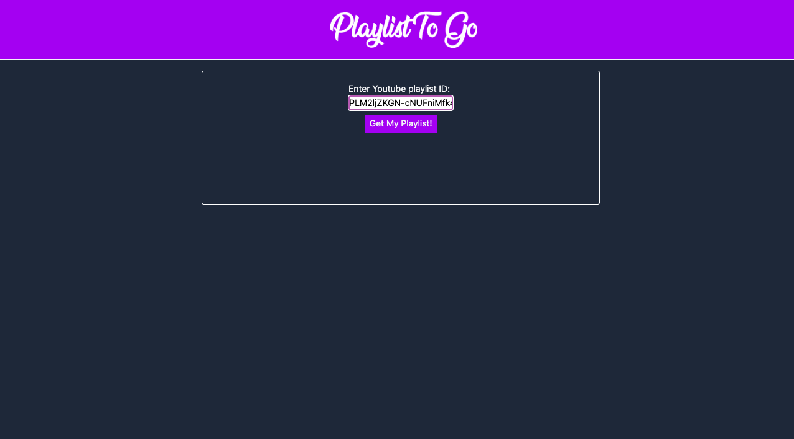
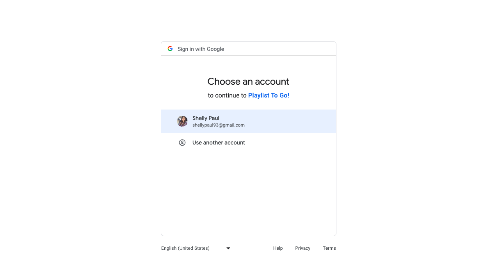
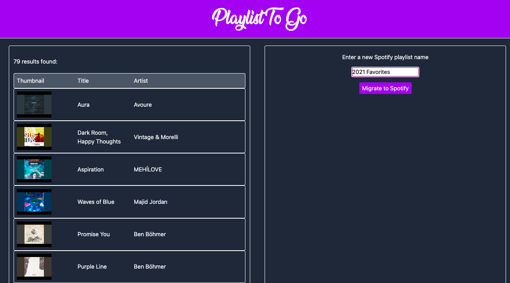
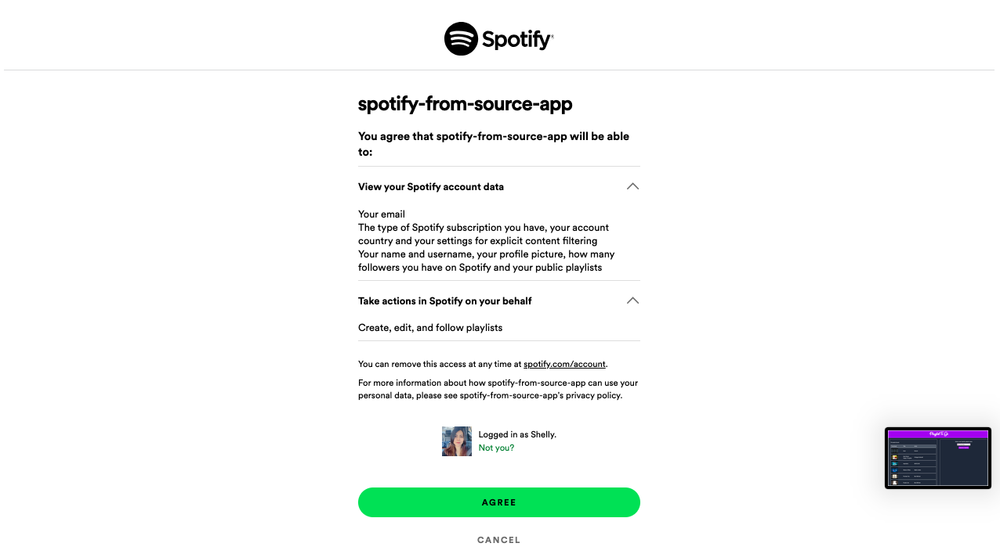
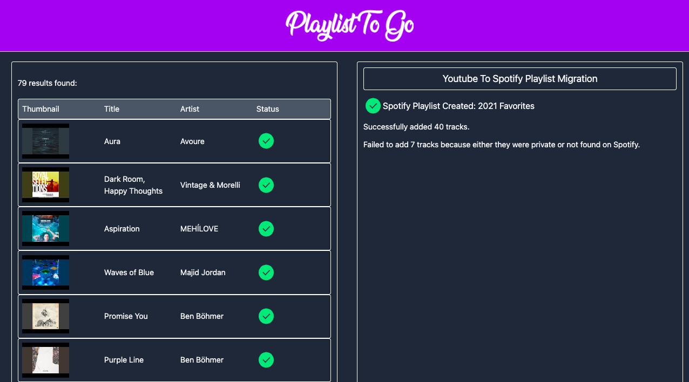
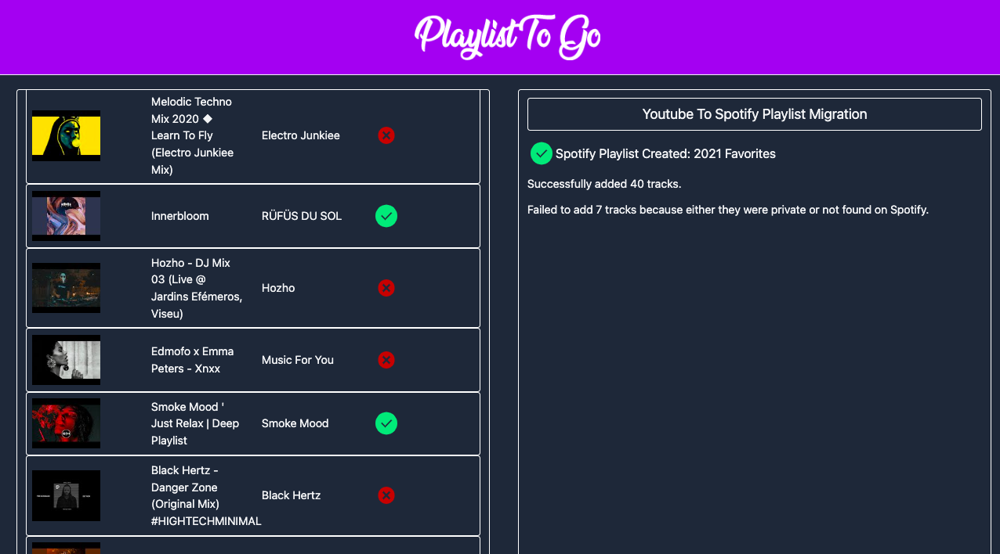
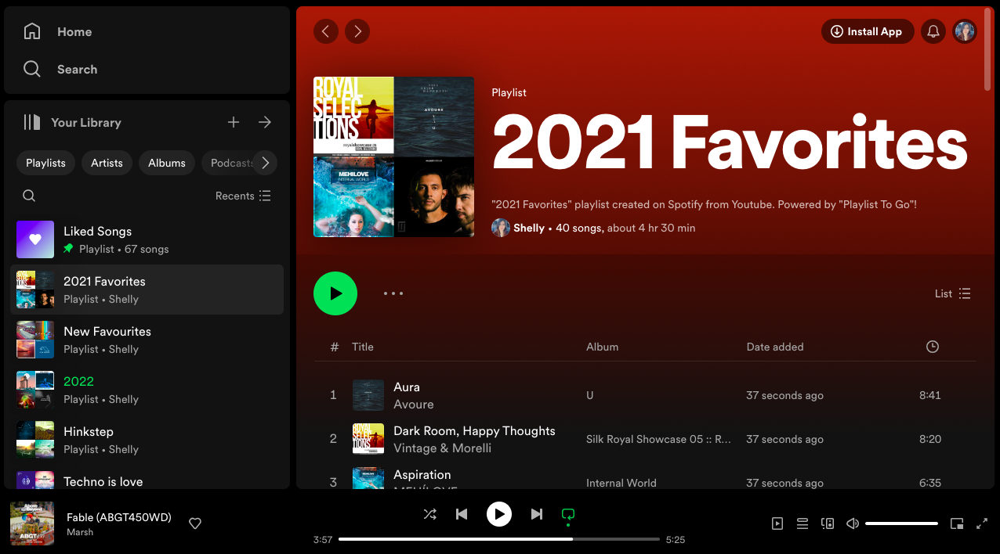

# Playlist To Go

## About the project

Transfer your playlists from YouTube to Spotify effortlessly with just a few clicks!

## How it works

Step 1: Enter playlist ID from Youtube playlist's URL.
 

Step 2: Redirection to Google Authorization Server, log in to authorize access to Youtube Data APIs in scope.

Step 3: Youtube playlist results are rendered. Input Spotify playlist name of your choice.

Step 4: Redirection to Spotify Authorization Server, log in to authorize access to Spotify Data APIs in scope.
 

Step 5: Spotify playlist is created with success and failure reporting.
 

Step 6: Example of successfully migrated tracks denoted by green tick, and failed tracks denoted by red cross.
 

Step 7: Validation of playlist creation on Spotify.
 

## Built With

* 
* 
* 
* 
* 

## Available Scripts

### npm start

Runs the app in the development mode.
Open http://localhost:3000 to view it in the browser.

The page will reload if you make edits.
You will also see any lint errors in the console.

### npm run build

Builds a static copy of your site to the `build/` folder.
Your app is ready to be deployed!

**For the best production performance:** Add a build bundler plugin like [@snowpack/plugin-webpack](https://github.com/snowpackjs/snowpack/tree/main/plugins/plugin-webpack) or [snowpack-plugin-rollup-bundle](https://github.com/ParamagicDev/snowpack-plugin-rollup-bundle) to your `snowpack.config.mjs` config file.

### Q: What about Eject?

No eject needed! Snowpack guarantees zero lock-in, and CSA strives for the same.
